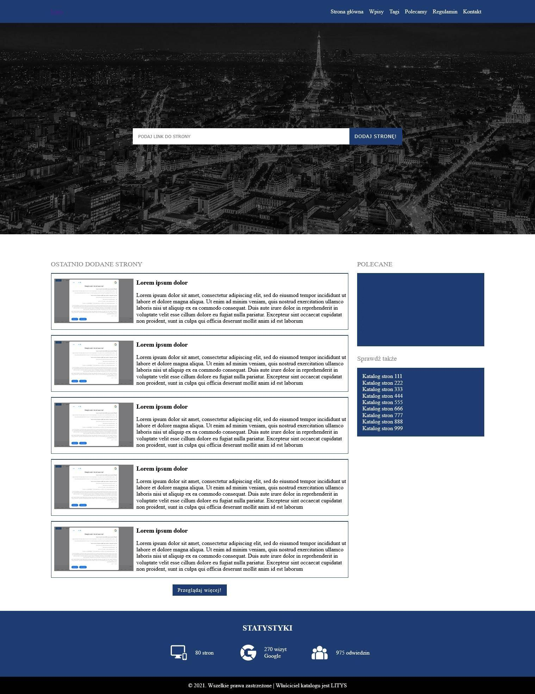

# web-directory
## Katalog stron WWW [Project is in Polish language]

Głównym założeniem projektu była szybkość działania strony.

## Instalacja
1. Wpisz `adres-domeny/install.php` w adresie przeglądarki
2. Przygotuj bazę danych i wprowadź wymagane dane w instalatorze

## Opis projektu
System do katalogu stron zawiera następujące strony:
- Strona główna - Spis ostatnio dodanych stron przez użytkowników. Sidebar z postami promującymi wybrane wpisy oraz 2 miejsca na reklamy (do wprowadzenia kodów HTML reklam)
- Dodaj stronę - Formularz dla użytkowników do samodzielnego dodawania stron do katalogu. Formularz zawiera: ochronę antybotową, ochronę przed dodaniem już istniejącej strony w serwisie, jeżeli strona nie została dodana z protokołem https automatycznie dodaje http. Dodatkowa opcja administracyjna pozwala włączyć **płatne wpisy**, wtedy pojawia się kolejne wymagane pole z miejscem na **KOD SMS**.
- Strony - Spis wszystkich stron dodanych przez użytkowników. Prosta paginacja ułatwia przeglądanie stron.
- Strona - Pojedyncza strona dodana przez użytkownika promująca serwis. Zawiera; nagłówek, opis, ocenę serwisu, numer ID w katalogu, słowa kluczowe, IP strony, kod HTML do wstawienia na stronę, listę podobnych wpisów.
- Tagi - chmura tagów
- Polecamy - Lista polecanych serwisów przez administrację
- Regulamin - Strona z regulaminem serwisu
- Kontakt - Formularz kontaktowy z administratorem. Zawiera ochronę antybotową.

## Dodatkowe cechy projektu
- Administrator w dowolnym momencie może wygenerować aktulaną **sitemap-ę**. W panelu administratora wystarczy przycisnąć "Aktualizuj sitemap".
- Administrator może włączyć opcję "Nowo dodane strony wymagają akceptacji moderatora" oraz czy przy dodawaniu nowego serwisu będzie wymagana opłata SMS
